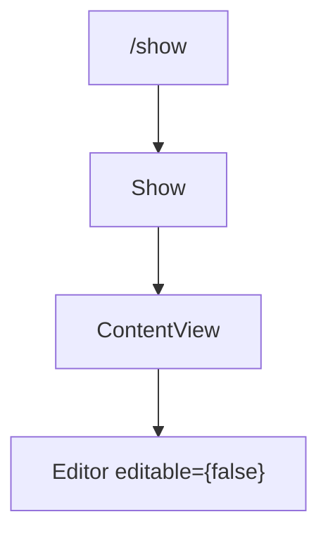
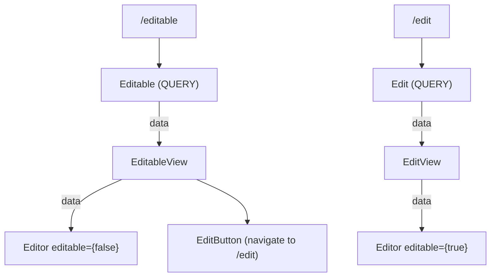

## Unauthorized User

```mermaid
flowchart TD

A["/show"]
B[Show]
C[ContentView]
D["Editor editable={false}"]
A --> B --> C --> D
```

## Authorized User

```mermaid
flowchart TD

A["/editable"]
B["Editable (QUERY)"]
C[EditableView]
D["Editor editable={false}"]
E["EditButton (navigate to /edit)"]
F["/edit"]
G["Edit (QUERY)"]
H[EditView]
I["Editor editable={true}"]

A --> B -->|data| C
C -->|data| D
C --> E
F --> G -->|data|H -->|data|I
```
