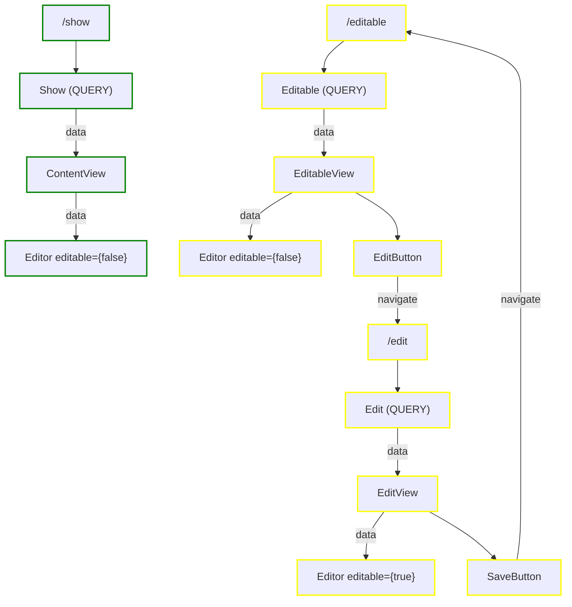

# Editable Content Flow

- GREEN: Regular User
- YELLOW: Authorized User

```mermaid
flowchart TD

A["/show"]
B["Show (QUERY)"]
C[ContentView]
D["Editor editable={false}"]

A --> B -->|data| C -->|data| D

A2["/editable"]
B2["Editable (QUERY)"]
C2[EditableView]
D2["Editor editable={false}"]
E2["EditButton"]
F2["/edit"]
G2["Edit (QUERY)"]
H2[EditView]
I2["Editor editable={true}"]
J2["SaveButton"]

A2 --> B2 -->|data| C2
C2 -->|data| D2
C2 --> E2 -->|navigate| F2 --> G2 -->|data|H2 -->|data|I2
H2 --> J2 -->|navigate| A2

classDef regularUser stroke:green,stroke-width:2px
classDef authorizedUser stroke:yellow,stroke-width:2px

class A,B,C,D regularUser
class A2,B2,C2,D2,E2,F2,G2,H2,I2,J2 authorizedUser
```
