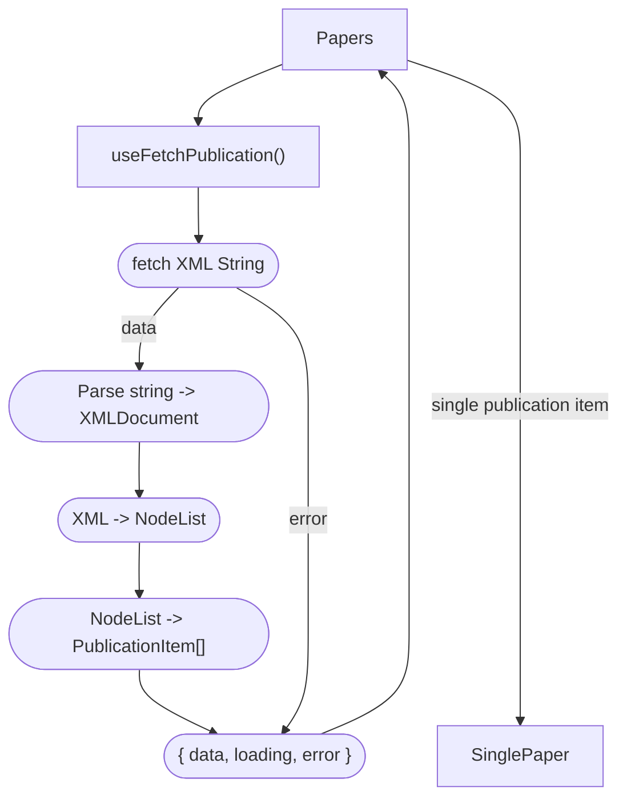

# Displaying Latest Publications

note: loading and error handling for Paper component is currently omitted



## Type

```ts
type PublicationItem = {
  title: string
  link: string
  description: string
  date: string
}
```
