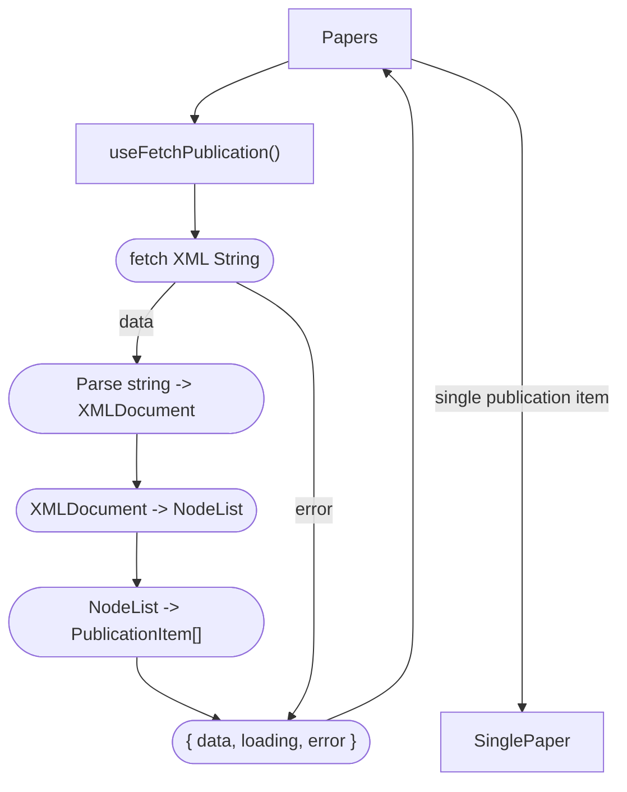
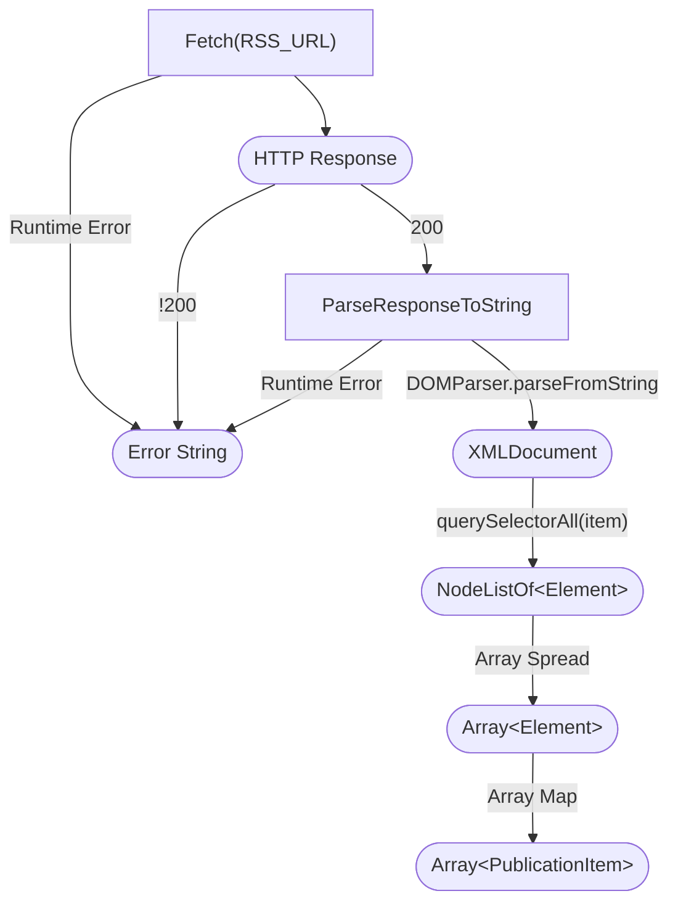
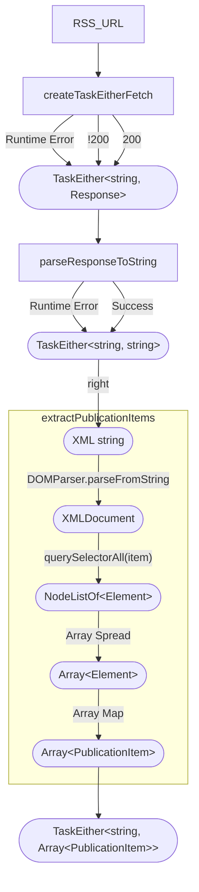

# Displaying Latest Publications

There exists a Paper component already that renders the latest papers on the front page. This proposed Paper component will reuse / replace this component.

note: loading and error handling for Paper component is currently omitted



## Type

```ts
type PublicationItem = {
  title: string
  link: string
  description: string
  date: string
}
```

## Data pipe

This diagram lays out the details of data pipe from when it is fetched to when it is transformed to `Array<PublicationItem>`, includes details about error handling



### Functional


