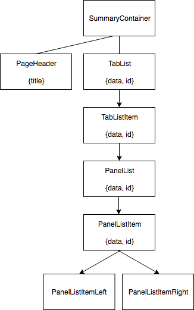
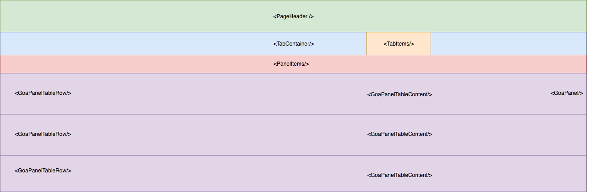

## Component Tree

**Main app layout:**

src/index.js -> src/app/layout/App

**GO tab:**

`<OntologyContainer />` (generates main tabs and fetches GOA data)

->`<OntologyTabContainer />` (generates nested GO tabs and passes filtered data to each tab)

--> `<InnerGoPanel />` (displays panels (i.e. molecular function) and passes filtered data)

---> `<DisplayTable>` (table for displaying the GO data)

**_Component Tree_**

**_Component Wireframe_**

**_Gene Summary page component breakdown:_**

1) **SummaryContainer** -> fetches data
2) **PageHeader** -> shows header
3) **TabContainer** -> shows AppBar with tabs
    - _TabItems_ -> generates tabs based on given data
4) **PanelItems** -> generates panels based on given data
   - _PanelWrapper_ -> wrapper that provides structure for each panel
   - _GoaPanel_ -> panel specific to GOA content
   - _GoaPanelTableRow_ -> the display for each row in GoaPanel
   - _GoaPanelTableContent_ -> displays data on right side of table
