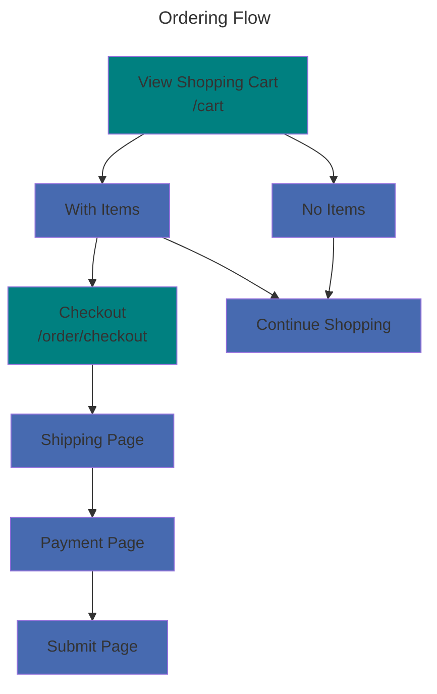

```mermaid
---
title: Ordering Flow
---

flowchart TD

A["`View Shopping Cart
/cart`"]
A1[With Items]
A2[No Items]
B["`Checkout
/order/checkout`"]
B1[Continue Shopping]
C[Shipping Page]
D[Payment Page]
E[Submit Page]

A --> A1
A --> A2
A1 --> B
A1 --> B1
A2 --> B1
B --> C
C --> D
D --> E

classDef page fill:#008080
classDef view fill:#476ab0
class A1,A2,B1,C,D,E,F view
class A,B page
```
