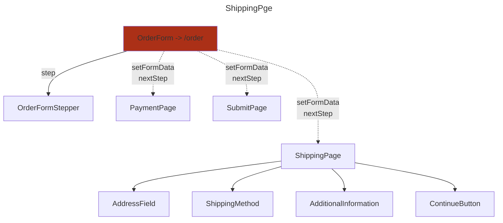

```mermaid
---
title: ShippingPge
---

flowchart TD

A[OrderForm -> /order]
B[OrderFormStepper]
C[ShippingPage]
D[PaymentPage]
E[SubmitPage]

C1[AddressField]
C2[ShippingMethod]
C3[AdditionalInformation]
C4[ContinueButton]

A -->|step| B
A -..->|setFormData\n nextStep| C
A -.->|setFormData\n nextStep| D
A -.->|setFormData\n nextStep| E

C --> C1
C --> C2
C --> C3
C --> C4

classDef state fill:#ab3017

class A state
```
