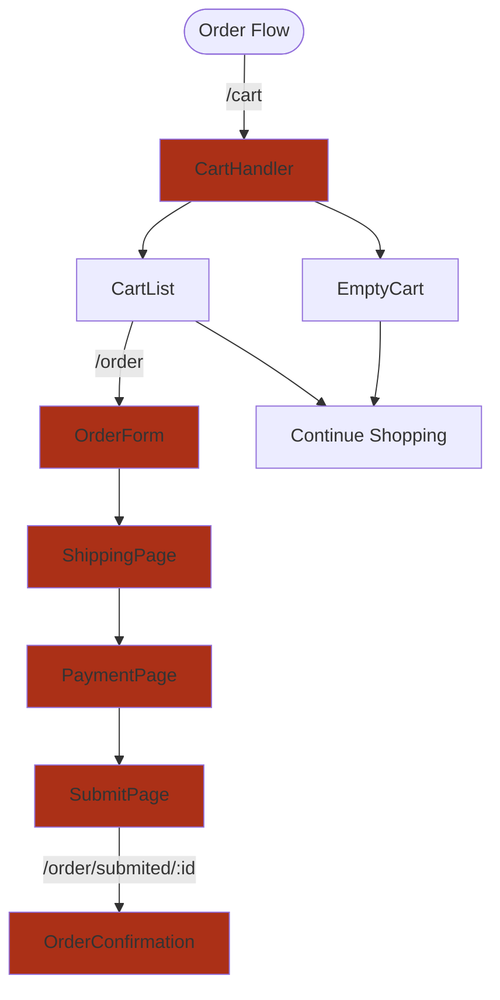

```mermaid

flowchart TD

X([Order Flow])
A[CartHandler]
A1[CartList]
A2[EmptyCart]
B[OrderForm]
B1[Continue Shopping]
C[ShippingPage]
D[PaymentPage]
E[SubmitPage]
F[OrderConfirmation]

X -->|/cart| A
A --> A1
A --> A2
A1 -->|/order| B
A1 --> B1
A2 --> B1
B -->  C
C --> D
D --> E
E --> |/order/submited/:id|F

classDef page fill:#ab3017
class A,B,C,D,E,F page
```
