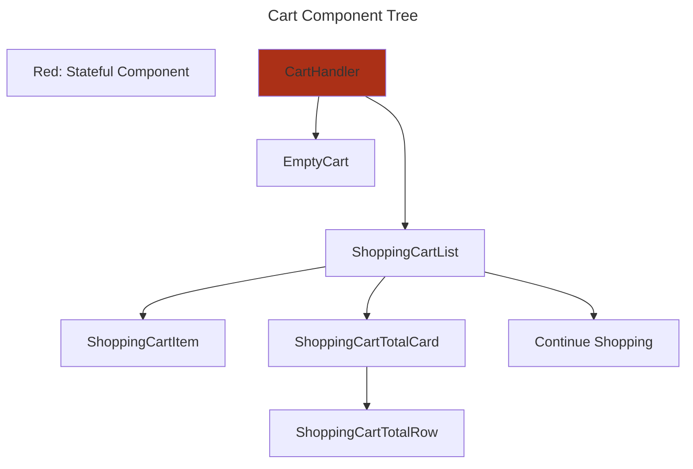

```mermaid
---
title: Cart Component Tree
---

flowchart TD

LEGEND[Red: Stateful Component]
A[CartHandler]
B[ShoppingCartList]
C[EmptyCart]
D[ShoppingCartItem]
E[ShoppingCartTotalCard]
F[ShoppingCartTotalRow]
G[Continue Shopping]

A ---> B
A --> C
B --> D
B --> E
B --> G
E --> F
classDef state fill:#ab3017
class A state
```
