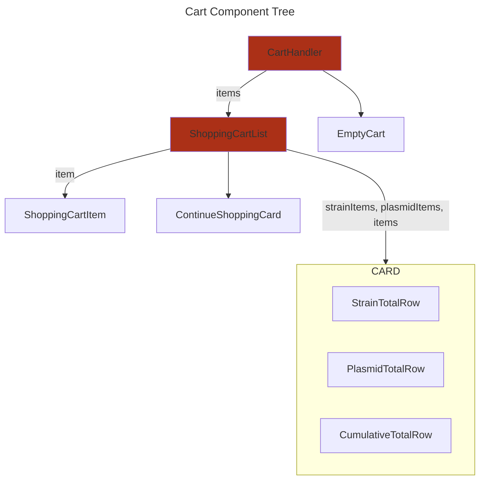

```mermaid
---
title: Cart Component Tree
---

flowchart TD

A[CartHandler]
B[ShoppingCartList]
C[EmptyCart]
D[ShoppingCartItem]
E1[StrainTotalRow]
E2[PlasmidTotalRow]
E3[CumulativeTotalRow]
F[ContinueShoppingCard]

A -- items --> B
A --> C
B ---> |strainItems, plasmidItems, items| CARD
B -- item --> D
B --> F
subgraph CARD
    E1
    E2
    E3
  end
classDef state fill:#ab3017
class A,B state
```
