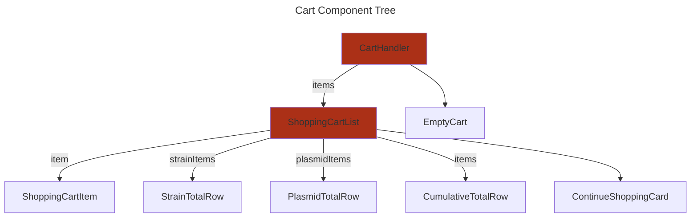

```mermaid
---
title: Cart Component Tree
---

flowchart TD

A[CartHandler]
B[ShoppingCartList]
C[EmptyCart]
D[ShoppingCartItem]
E1[StrainTotalRow]
E2[PlasmidTotalRow]
E3[CumulativeTotalRow]
F[ContinueShoppingCard]

A -- items --> B
A --> C
B -- item --> D
B -->|strainItems| E1
B -->|plasmidItems| E2
B -->|items| E3
B --> F


classDef state fill:#ab3017
class A,B state
```
