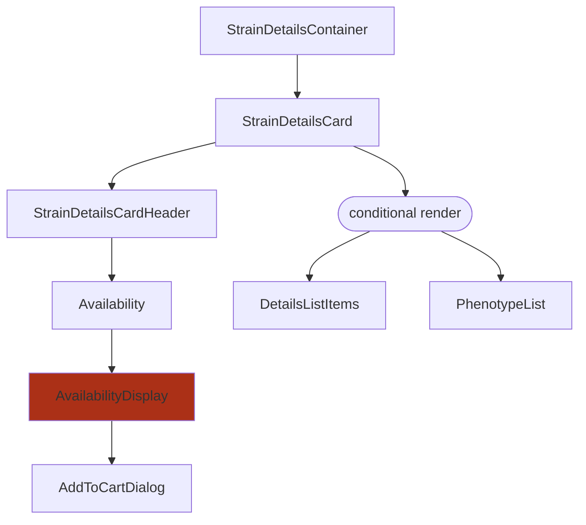

```mermaid

flowchart TD

A[StrainDetailsContainer]
C[StrainDetailsCard]
C2([conditional render])
D1[StrainDetailsCardHeader]
D2[Availability]
D3[AvailabilityDisplay]
D4[AddToCartDialog]
E[DetailsListItems]
F[PhenotypeList]

A --> C
C --> C2
C2 --> E
C2 --> F
C --> D1
D1 --> D2
D2 --> D3
D3 --> D4
classDef state fill:#ab3017
class D3 state
```
