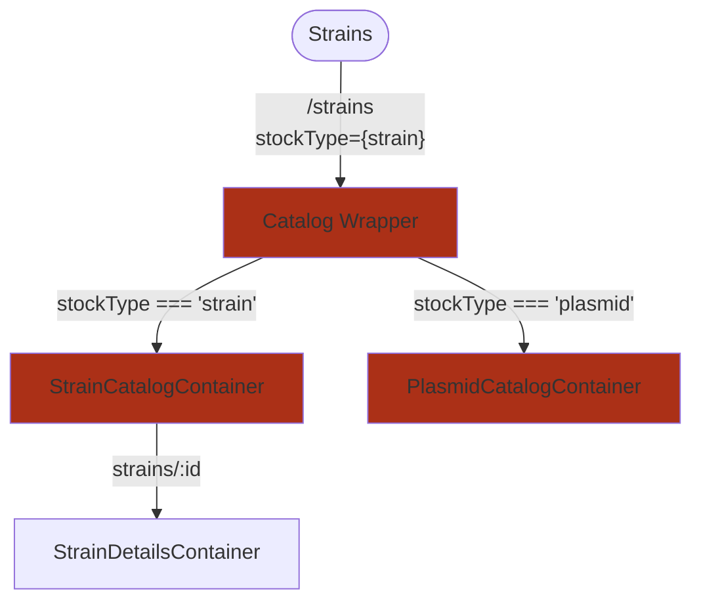

```mermaid

flowchart TD

X([Strains])
A[Catalog Wrapper]
B1[StrainCatalogContainer]
B2[PlasmidCatalogContainer]
C[StrainDetailsContainer]


X -->|"/strains\nstockType={strain}"| A
A -->|"stockType === 'strain'"| B1
A -->|"stockType === 'plasmid'"|B2
B1 -->|strains/:id|C

classDef state fill:#ab3017
class A,B1,B2 state
```
