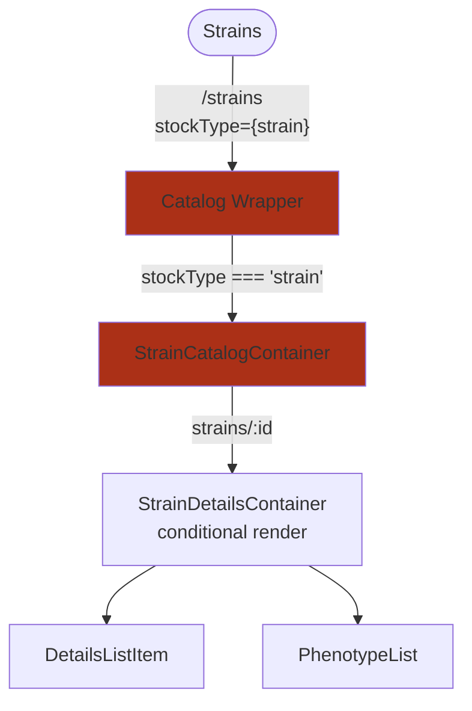

```mermaid

flowchart TD

X([Strains])
A[Catalog Wrapper]
B1[StrainCatalogContainer]
C[StrainDetailsContainer\n conditional render]
D[DetailsListItem]
E[PhenotypeList]

X -->|"/strains\nstockType={strain}"| A
A -->|"stockType === 'strain'"| B1
B1 -->|strains/:id|C
C --> D
C --> E

classDef state fill:#ab3017
class A,B1,B2 state
```
