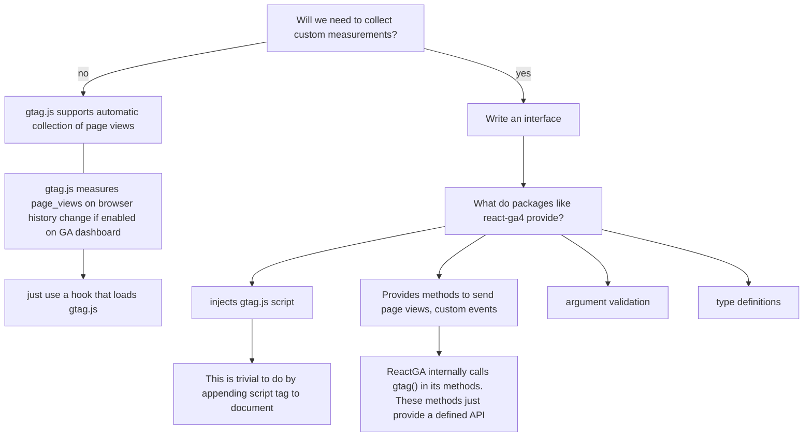

## google analytics -- should we use a package / write our own class/component?

If we end up collecting custom measurements, it might be worth writing a class / component that provides an interface to use gtag().
It sounds conceptually easy enough. It's also something that can probably be deferred to when it becomes necessary.

If we just need to track page views, then the hook described below should be enough.

a useGoogleAnalytics hook that

1. checks for production environment (might not be necessary, there are ways to filter developer traffic https://support.google.com/analytics/answer/13296761?sjid=879247116944398152-NC but haven't looked into that closely yet)
2. loads the gtag.js script, so we don't need to edit our HTML directly
3. tracks bfcache restores
