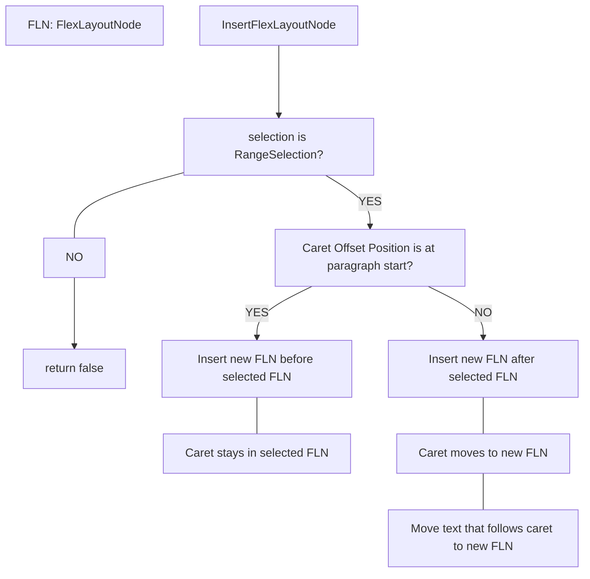

# Inserting new FlexLayout Nodes

```mermaid
flowchart TD
Legend[FLN: FlexLayoutNode]

A[InsertFlexLayoutNode]
B[selection is RangeSelection?]
C[return false]
D[Caret Offset Position is at paragraph start?]
E1[Insert new FLN before selected FLN]
F1[Caret stays in selected FLN]
E2[Insert new FLN after selected FLN]
F2[Caret moves to new FLN]
G[Move text that follows caret to new FLN]

A ---> B
B --- NO --> C
B -- YES --> D
D -- YES --> E1
E1 --- F1
D -- NO --> E2
E2 --- F2
F2 --- G
```

If the selection is not collapsed (i.e text is highlighted), the highlighted text will be deleted.
