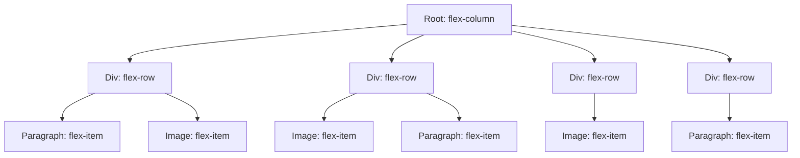

# Approach: Nested Flex Box

Create a new LexicalNode subclass **FlexRowNode** with a createDOM method that returns a `<div>` element. The `<div>` element will be a flex row container with `property justify-content: center` that will contain our `<paragraph>` elements and `` elements. The paragraphs and images will be rendered side by side. The FlexRowNode will initially have an empty paragraph node as a child.

ImageNodes will be inserted as the first or last child of the FlexRowNode depending on the position of the selection caret. If the X position of the selection range is closer to the **left** of the paragraph bounding box, the ImageNode will be the **first** child. If the X position of the selection range is closer to the **right** of the paragraph bounding box, the ImageNode will be the **last** child.




### Implications

Currently, when the user presses enter, Lexical inserts a **ParagraphNode** in the root container. Create a `KEY_ENTER_COMMAND` listener with a higher priority that inserts a **FlexRowNode** instead.

There will also need to be some logic to delete the FlexRowNode if all of its children are removed. This could potentially be achieved by simply overriding the `canBeEmpty()` method to return false.

## Drawbacks

1 - If there is enough text in the paragraph element, all the space to the right of the image will be filled with text. However, if there is not enough text to fill the paragraph element, we will be left with a gap between the paragraph and the next FlexContainerRow.

2 - If there is an image between two paragraphs, then the text on a given line can't be read from left to right across the entire container.

It will look like this:

```

this is one paragraph about apples  +-------+  this is a different paragraph about
apples are a red fruit that grow in |  img  |  cats. There are many types of cats
trees                               +-------+
```

not this:

```
This is one paragraph about apples. +-------+  Apples are a red fruit that grow in trees
This is a different paragraph about |  img  |  cats. There are many types of cats
                                    +-------+
```

a solution for this could be to always insert images at the start of end of the section.

## Overriding Default Behavior

### LexicalComposer Initializes Root by Appending ParagraphNode

If no `initialEditorState` is provided as a property to the `editorConfig` prop in the `LexicalComposer` component, it will initialize the editor state with a `ParagraphNode` appended to the root. To prevent this, simply provide an `initialEditorState` with a flex row node as a child of root.
