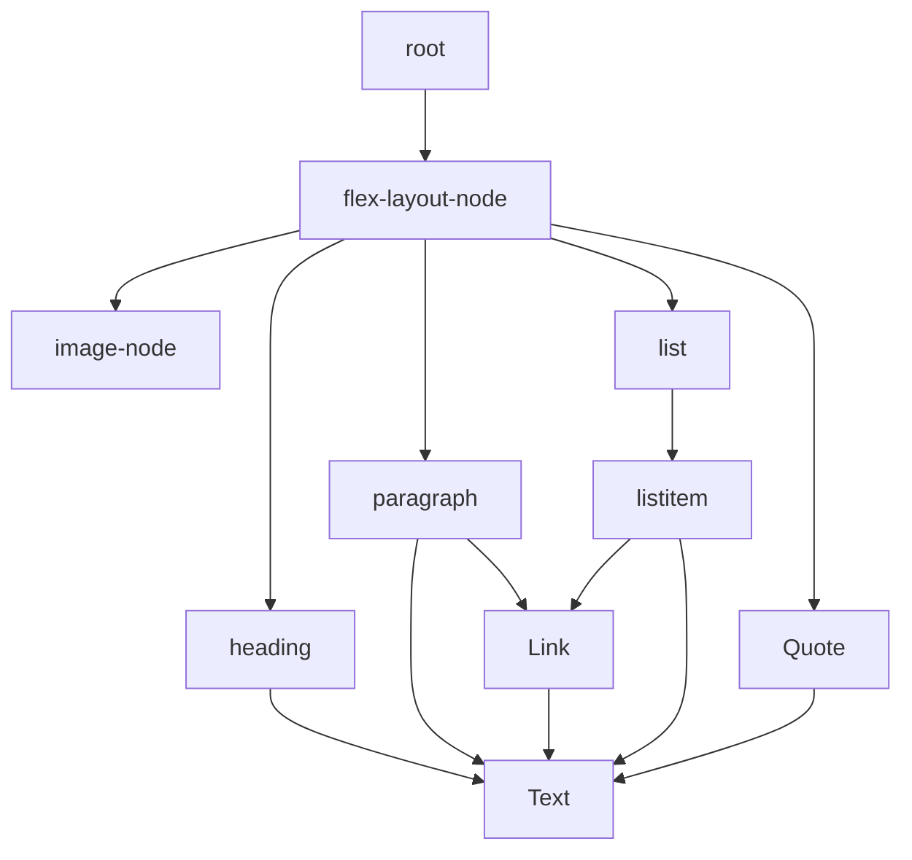

# Flex Layout Plugin

Replaces Lexical's default top-level `paragraph` node with a custom `flex-layout` wrapper that enables inline (side-by-side) layout of sibling nodes such as text and images within the same block.

## Structure


```mermaid
flowchart TD

A[root]
B[flex-layout-node]
C[paragraph]
D[heading]
E[list]
F[listitem]
G[image-node]
H[Link]
I[Quote]
Z[Text]


A --> B
B --> G
B --> D
B --> C
B --> E
B --> I
C --> Z
E --> F
C --> H
H --> Z
F --> H
I --> Z
F --> Z

D --> Z

```

## Components

### `FlexLayoutNode`

A custom `ElementNode` (`type: "flex-layout"`) that serves as the top-level block container.

- **`createDOM`** returns a `<div>` with `display: flex` and `column-gap: 10px` inline styles. Applies `theme.flexLayout` CSS class if defined in editor config.
- **`updateDOM`** returns `false` — Lexical does not manage DOM updates for this node.
- **`canBeEmpty`** returns `false` — every flex-layout node must contain at least one child.
- **`getParagraphNodeOrThrow`** finds and returns the child `ParagraphNode`, throwing if none exists.
- **`$createFlexLayoutNode`** factory creates a `FlexLayoutNode` and automatically appends a new `ParagraphNode`.

**Type guard:** `$isFlexLayoutNode(node)` checks `node.getType() === "flex-layout"`.

### `FlexLayoutPlugin`

A React component that intercepts the Enter key press.

- Registers a command listener for `INSERT_PARAGRAPH_COMMAND` at `COMMAND_PRIORITY_LOW`.
- Redirects paragraph insertion to `InsertFlexLayoutNode` logic.
- Also registers a `SELECTION_CHANGE_COMMAND` listener for debug inspection of heading/list nesting.

### `InsertFlexLayoutNode`

Called on Enter. Determines where to insert a new `flex-layout` node relative to the caret position.

1. Gets the current selection — returns `false` if not a `RangeSelection`.
2. Non-collapsed selection: deletes highlighted text and returns.
3. Gets the caret point via `getPointAtCaret`.
4. Gets the top-level element. Returns `false` if it's a `RootNode`.
5. **Three insertion cases:**
   - **Caret at offset 0** (beginning of text): inserts new flex-layout **before** the current one.
   - **Caret at offset > 0** (middle/end of text): inserts new flex-layout **after** the current one, moves trailing text to the new node's paragraph via `handleTextContent`, moves caret to start of new paragraph.
   - **Caret on an element (non-text) node**: inserts new flex-layout **after** the current one, moves caret to start of new paragraph.

### Helpers

- **`getPointAtCaret`** — returns the focus point of a collapsed `RangeSelection`, or `undefined`.
- **`getTextEdges`** — splits a string at an offset into `[before, after]`.
- **`handleTextContent`** — splits text at the caret offset, keeping text before the caret in the original node and moving text after the caret to a target paragraph node.

## Integration Points

| Package | Role |
|---------|------|
| `packages/editor` | Registers `FlexLayoutNode` in the editor's `nodes` array. Renders `<FlexLayoutPlugin />` inside `LexicalComposer`. Default initial state uses `flex-layout` as the top-level child. |
| `packages/editor-toolbar` | Treats `"flex-layout"` as the "Normal" block type (`BlockTypes.PARAGRAPH`). `formatParagraph()` wraps selected nodes with `$createFlexLayoutNode()`. |
| `packages/image-plugin` | Uses `FlexLayoutNode` for inline image placement. `insertNodeIntoFlexRow` places images left or right of text based on caret X coordinate relative to the paragraph's DOM bounding box. Falls back to appending directly to the `FlexLayoutNode` when no paragraph node is found from the selection. |

## Serialized JSON Format

```json
{
  "root": {
    "children": [
      {
        "children": [
          {
            "children": [...],
            "type": "paragraph"
          }
        ],
        "type": "flex-layout"
      }
    ],
    "type": "root"
  }
}
```

Every top-level block is a `flex-layout` node containing a `paragraph` node (plus optionally images or other inline elements).
