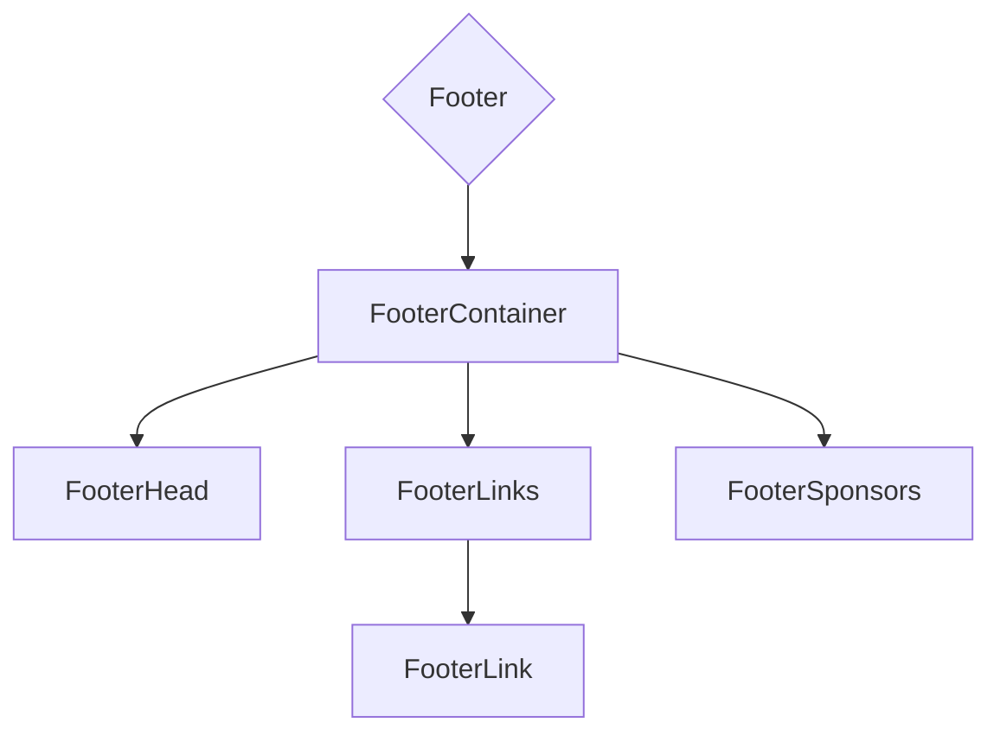

# @dictyBase/footer

footer Component library for dictyBase.

    
    <small><i>dictyBase footer component with default data</i></small>

## Component architecture

```mermaid
graph TD
    A{Footer} --> B[FooterContainer]
    B --> B1[FooterHead]
    B --> B2[FooterLinks]
    B --> B3[FooterSponsors]
    B2 --> C[FooterLink]
```
