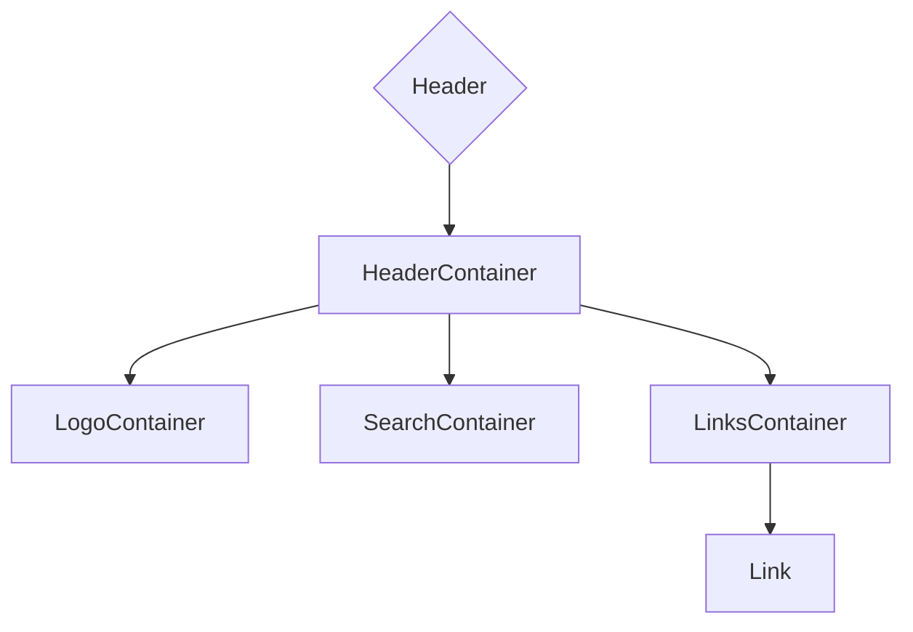

# @dictybase/header
Header Component library for dictyBase.

## Component architecture

```mermaid
graph TD
    A{Header} --> B[HeaderContainer]
    B --> B1[LogoContainer]
    B --> B2[SearchContainer]
    B --> B3[LinksContainer]
    B3 --> C[Link]
```
