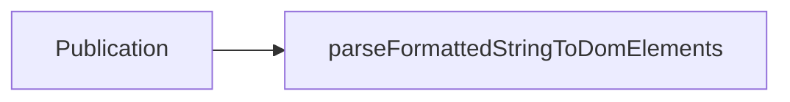
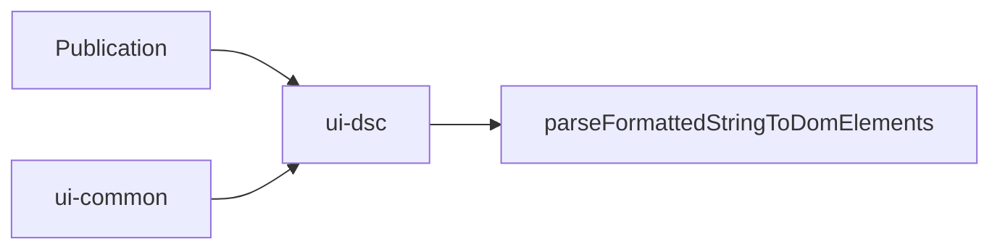

# parseFormattedStringToDomElements Refactor
 
- The **interleaving** logic is rewritten and separated into a generalized function
- parseFormattedStringToDomElements is moved to from `publication` app to the `@dictybase/ui-common` package
  - can now be shared between `@dictybase/ui-dsc` and `publication`

after

